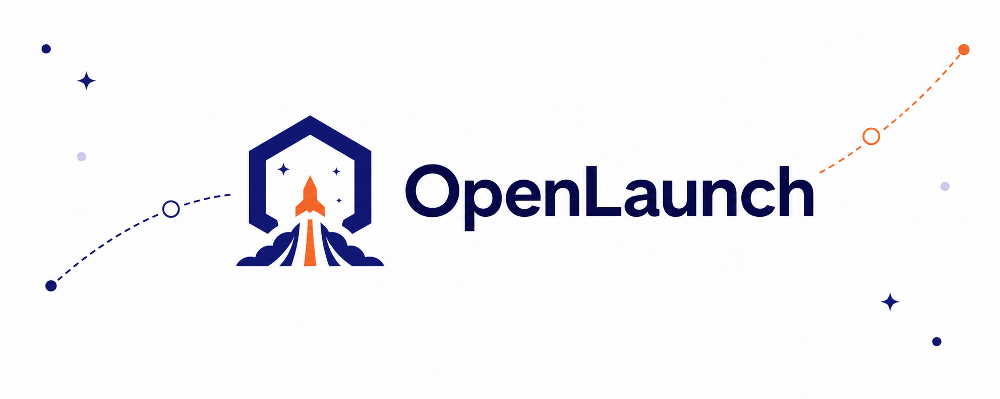

# OpenLaunch

[](https://github.com/belweave/openlaunch)
[](./LICENSE)
[](https://github.com/belweave/openlaunch/pkgs/container/openlaunch)



OpenLaunch is a self-hosted AI workspace for individuals and teams, combining chat, model management, retrieval, tools, collaboration, and automations with your own providers and infrastructure.

## What it supports

- **Anthropic and compatible APIs** — Claude model discovery, chat, streaming, tools, multimodal inputs, errors, and usage through the native Messages API.
- **OpenAI and OpenAI-compatible APIs** — connect OpenAI or any service exposing the familiar `/v1` model and chat endpoints.
- **Ollama** — run local models alongside hosted providers.
- **Workspace features** — reusable models, prompts, knowledge, tools, skills, web search, code execution, notes, channels, calendars, and automations.
- **Retrieval and administration** — file indexing, multiple vector databases, OAuth, LDAP, trusted headers, SCIM, groups, and granular permissions.

## Quick start

Docker Compose starts OpenLaunch and Ollama and stores their data in named volumes:

```bash
git clone https://github.com/belweave/openlaunch.git
cd openlaunch
docker compose up -d
```

Open [http://localhost:3000](http://localhost:3000), create the first account, then configure providers under **Admin Panel → Settings → Connections**.

To update an image-based installation:

```bash
git pull --ff-only
docker compose pull
docker compose up -d
```

Use `docker compose up -d --build` when you want to build the checked-out source locally.

## Provider configuration

Connections can be managed in the admin UI or initialized with `OLLAMA_BASE_URL`, `OPENAI_API_BASE_URL` and `OPENAI_API_KEY`, or `ANTHROPIC_API_BASE_URL` and `ANTHROPIC_API_KEY`.

For an Anthropic-compatible gateway, set the base URL through the version prefix—for example, `https://gateway.example.com/v1`. OpenLaunch calls its `/models` and `/messages` routes. The admin UI also supports Bearer authentication, custom headers, multiple connections, and per-connection model filters.

See [.env.example](./.env.example) for common settings. Container data lives at `/app/backend/data`; back up the volume before major upgrades.

## Run from source

Source builds require Python 3.11 or 3.12 and Node.js 18–22:

```bash
npm ci
npm run build
python -m venv .venv
source .venv/bin/activate
pip install .
openlaunch serve
```

Use `npm run dev` for frontend development and `backend/dev.sh` for backend development. Before contributing, run the relevant checks from [package.json](./package.json) and [pyproject.toml](./pyproject.toml).

> [!CAUTION]
> Tools and functions can execute code on the OpenLaunch host. Grant creation permissions only to fully trusted users and use a stable `OPENLAUNCH_SECRET_KEY`, TLS, restricted CORS, and regular data backups in production.

## Project links

- [Releases](https://github.com/belweave/openlaunch/releases)
- [Issues](https://github.com/belweave/openlaunch/issues)
- [Discussions](https://github.com/belweave/openlaunch/discussions)
- [Security policy](./docs/SECURITY.md)
- [MIT License](./LICENSE)
